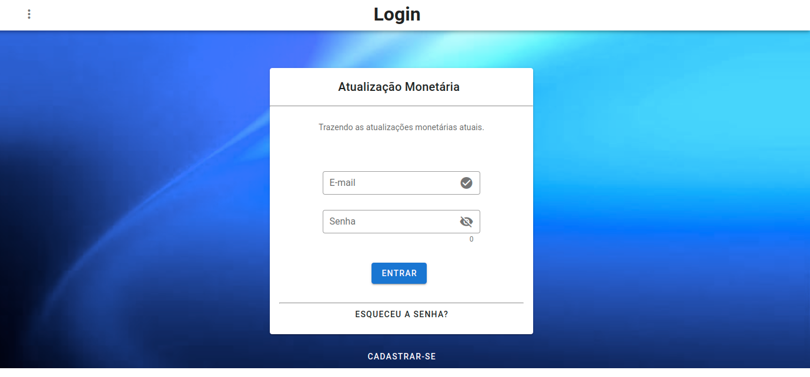
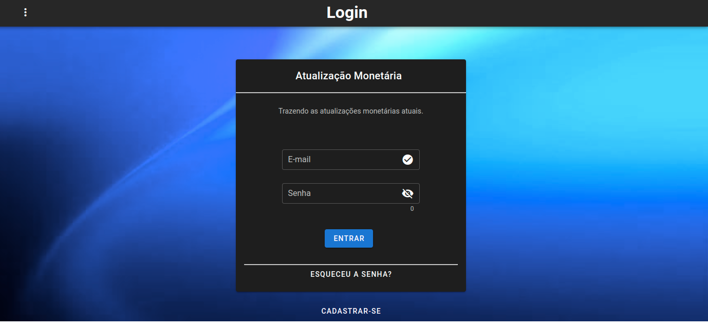
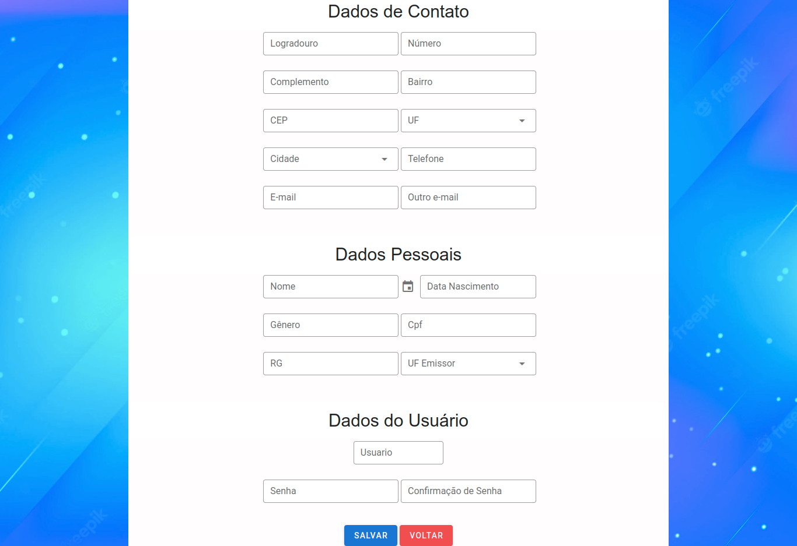
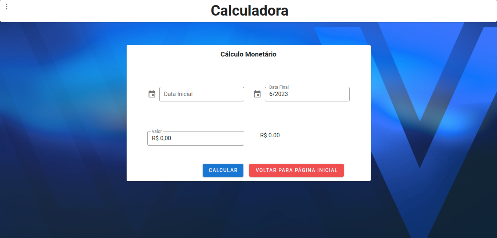
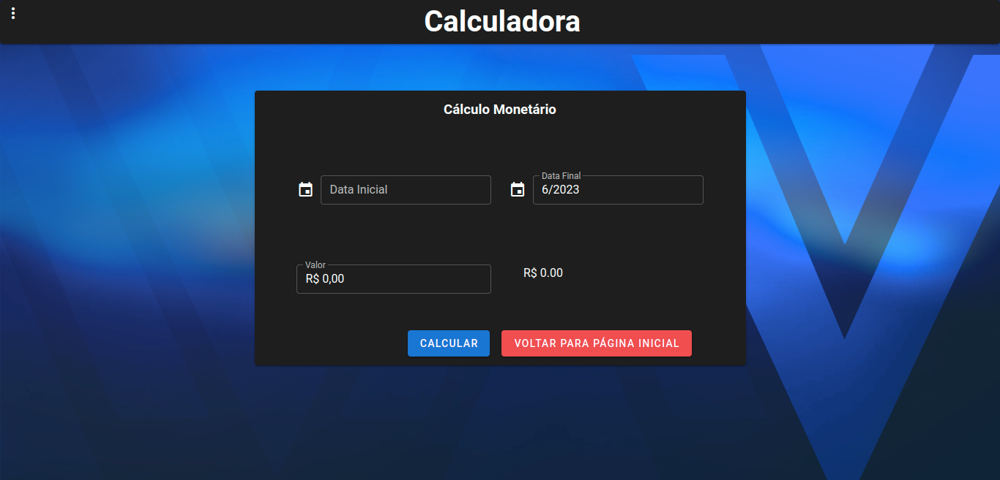

# Calculadora de atualização monetária

#### Português
A Calculadora de Atualização Monetária é uma ferramenta que permite calcular o valor atualizado de um determinado montante financeiro, levando em consideração a variação do poder de compra da moeda ao longo do tempo. Ela desempenha um papel essencial em diversas áreas, como finanças pessoais, contabilidade, economia e direito, fornecendo uma maneira precisa de ajustar valores nominais para valores corrigidos pela inflação.
O principal objetivo da Calculadora de Atualização Monetária é oferecer uma solução para o problema da desvalorização da moeda ao longo do tempo. Com o passar dos anos, a inflação faz com que o valor de uma quantia em dinheiro seja reduzido, já que a mesma quantidade de dinheiro não compra mais a mesma quantidade de bens e serviços. A atualização monetária permite levar em consideração essa perda de poder de compra, trazendo os valores para o presente de forma mais precisa. 

#### English

The Monetary Update Calculator is a tool that allows you to calculate the updated value of a given financial amount, taking into account the variation in the purchasing power of the currency over time. It plays an essential role in areas such as personal finance, accounting, economics, and law, providing an accurate way to adjust nominal values ​​to inflation-adjusted values.
The main purpose of the Currency Update Calculator is to offer a solution to the problem of currency devaluation over time. Over the years, inflation causes the value of a sum of money to be reduced, as the same amount of money no longer buys the same amount of goods and services. Monetary restatement allows taking into account this loss of purchasing power, bringing values ​​to the present more precisely.

### Images

#### Login (light)


#### Login (dark)


#### Register


#### Calculator (light)


#### Calculator (dark)


## Used
```
- VueJS;
- Vue router;
- Vuex;
- EsLint;
- Axios;
- Componentization;
- Code versioning; 
- Theme dark and light;
```
### Project setup
```
npm install
```

### Compiles and hot-reloads for development
```
npm run serve
```

### Compiles and minifies for production
```
npm run build
```

### Lints and fixes files
```
npm run lint
```

